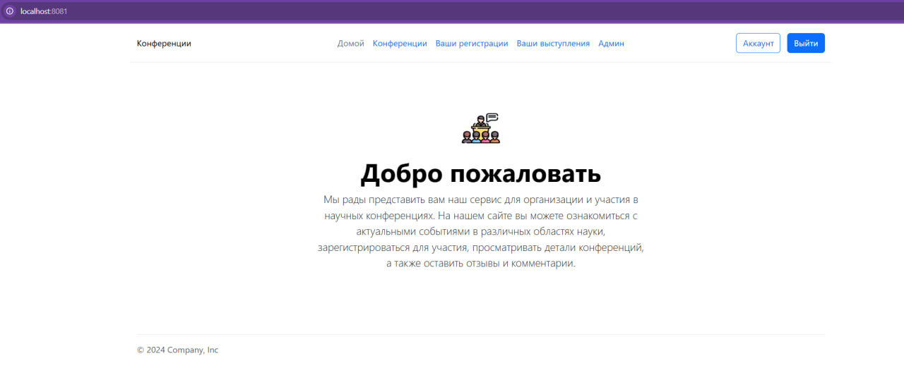
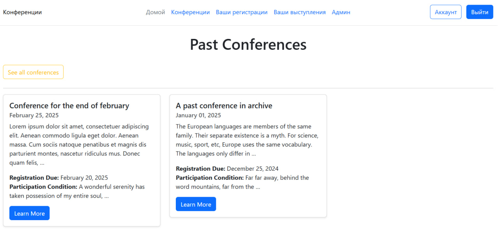
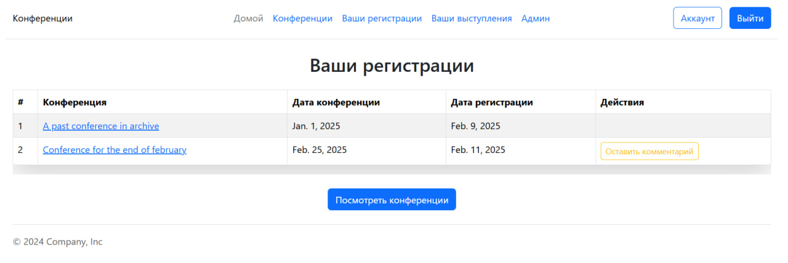
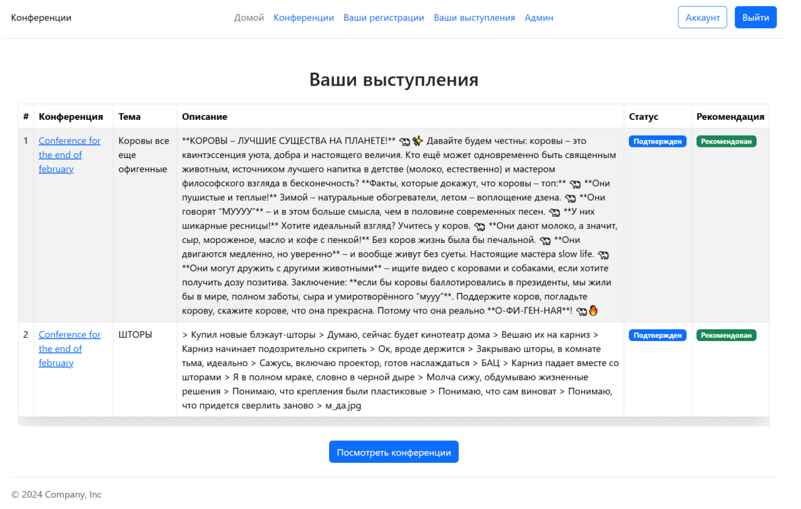
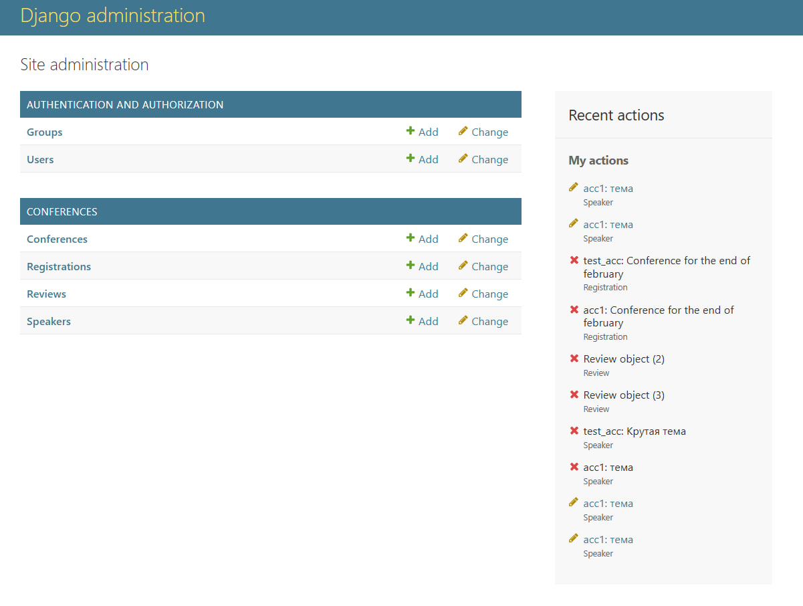

# Отчет по Лабораторной работе №2

## Список научных конференций

Необходимо реализовать следующий функционал:

- Регистрация новых пользователей.
- Просмотр конференций и регистрацию авторов для выступлений.
  Пользователь должен иметь возможность редактирования и удаления своих
  регистраций.
- Написание отзывов к конференциям. При добавлении комментариев,
  должны сохраняться даты конференции, текст комментария, рейтинг (1-10),
  информация о комментаторе.
- Администратор должен иметь возможность указания результатов
  выступления (рекомендован к публикации или нет) средствами Django-
  admin.
- В клиентской части должна формироваться таблица, отображающая всех
  участников по конференциям.

## Структура сервиса

### Навигация по сайту

```
+ /
+ /conferences?arhcive
    + /id
        + /register
        + /propose_speach
+ /registrations
    + /id
        + /delete
        + /comment
+ /performances
    /id
        /edit
        /delete
+- /account
+ /login
+ /register
+ /logout
/admin
```

## Скриншоты результата

### Домашнаяя страница



### Список конференций



### Список регистраций



### Список выступлений



### Административная панеель



## Запуск

```
python manage.py runserver localhost:8080
```
