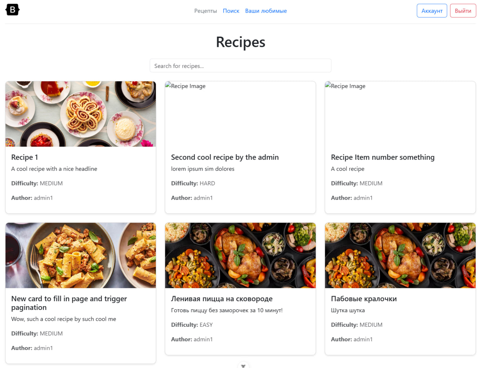

# Отчет по Лабораторной работе №4

## Сервис для обмена рецептами и кулинарных блогов

## 1. Аутентификация

- Настройка Axios с базовым URL и токеном аутентификации.
- Добавление интерцепторов для автоматической подстановки токена и обработки ошибок.

### Регистрация (`registerUser`)

- Отправляет данные пользователя (`email`, `username`, `password`) на `auth/users/`.
- Проверяет совпадение паролей перед отправкой.
- В случае успеха показывает сообщение и возвращает пользователя назад.

### Логин (`PerformLogin`)

- Проверяет учетные данные (`username`, `password`).
- При успешной авторизации перенаправляет пользователя на главную страницу.
- В случае ошибки выводит сообщение.

## 2. Работа с рецептами

### Загрузка списка рецептов (`fetchRecipes`)

- Отправляет GET-запрос на `recipes/` с возможностью поиска.
- Сохраняет загруженные рецепты и ссылки для пагинации (`nextPage`, `prevPage`).
- Автоматически обновляет список при изменении `searchTerm`.

### Загрузка конкретного рецепта (`fetchRecipe`)

- Загружает рецепт по `id` из `route.params`.
- В случае ошибки устанавливает `error.value`.

### Создание рецепта (`createRecipe`)

- Отправляет POST-запрос на `recipes/` с новыми данными.
- Поле `ingredients` преобразуется в массив перед отправкой.
- При успешном создании происходит редирект на страницу рецепта.

### Редактирование рецепта (`updateRecipe`)

- Отправляет PUT-запрос на `recipes/{id}/` с обновленными данными.
- Поле `ingredients` также преобразуется в массив.
- В случае успеха происходит редирект обратно на страницу рецепта.

### Удаление рецепта (`deleteRecipe`)

- Отправляет DELETE-запрос на `recipes/{id}/`.
- После удаления происходит редирект на главную страницу.

## 3. Управление шагами приготовления

### Загрузка шагов (`fetchSteps`)

- Загружает список шагов рецепта `recipes/{id}/steps`.

### Добавление шага (`addStep`)

- Отправляет новый шаг через `POST recipes/{id}/steps/`.
- Добавляет шаг в `steps.value`.

## 4. Функция лайков

### Получение статуса лайка (`fetchStatus`)

- Загружает текущее состояние лайка (`true` / `false`).

### Переключение лайка (`toggleLike`)

- Отправляет POST-запрос на `recipes/{id}/like/`.
- Инвертирует текущее состояние лайка.

## 5. Дополнительные функции

### Проверка прав редактирования (`fetchEditable`)

- Отправляет GET-запрос на `recipes/{id}/can_edit/`.
- Устанавливает `canEdit.value` в `true`, если у пользователя есть права редактирования.

### Динамическое изменение класса кнопки (`buttonClass`)

- Изменяет стили кнопки лайка в зависимости от состояния (`btn-outline-danger` или `btn-danger`).

## Скриншоты результата

### Главная страница


### Список Рецептов



### Страница профиля


### Создание рецепта


### Страница рецепта


## Запуск

```
npm run dev
```
